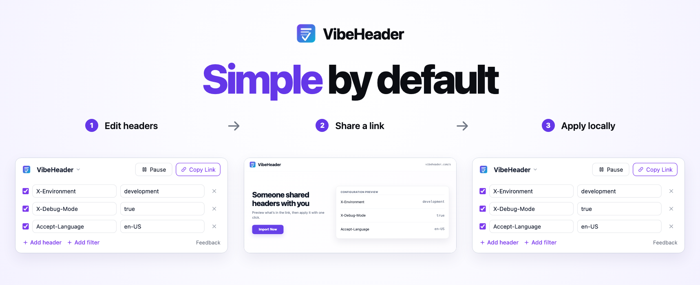
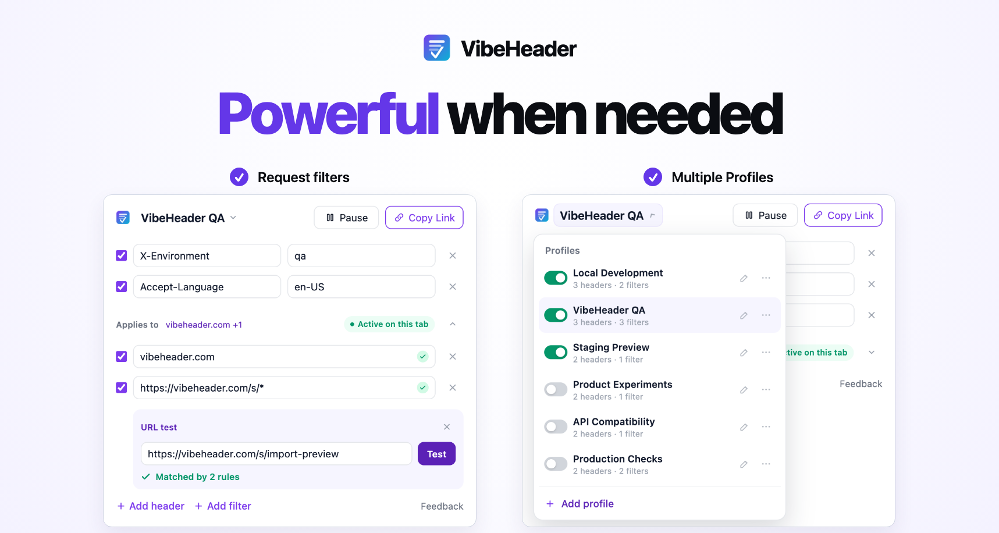

# VibeHeader

[](https://chromewebstore.google.com/detail/vibeheader/imjffcblfdblnjcekpamheljmolejoll) [](LICENSE)

> A lightweight, privacy-first HTTP request header editor for Chrome and Edge — with request filters, Profiles, and one-click share links.

**[Install for Chrome →](https://chromewebstore.google.com/detail/vibeheader/imjffcblfdblnjcekpamheljmolejoll)** · **[Install for Edge →](https://microsoftedge.microsoft.com/addons/detail/vibeheader/eajhmeknjclcllddogondingcdjpdbag)**

VibeHeader lets you add custom HTTP **request headers**, control where they apply, organize them into Profiles, and share complete setups with a single link. No account, no ads, no tracking — everything is stored locally on your device.

<p align="center">
  
</p>

<p align="center">
  
</p>


## ✨ Features

- ⚡ **Fast header editing** — add, edit, toggle, and remove request headers with a minimal UI built for daily debugging.
- 🎯 **Request filters** — apply headers only to matching domains, URLs, wildcard patterns, or regular expressions, with a built-in URL tester.
- 🗂️ **Multiple Profiles** — keep projects and environments separate, switch between them quickly, or run several at the same time.
- 📝 **Optional header comments** — describe individual headers and share those notes with your Profile. Show or hide comments across all Profiles.
- ↕️ **Header ordering** — move frequently used headers with drag-and-drop or the keyboard, with Undo while arranging them.
- 🔗 **One-click Profile sharing** — share a Profile, including its enabled headers, comments, and valid request filters, without exporting JSON. Recipients can preview it before importing.
- 🔒 **Privacy-first** — no backend, no account, no ads, and no tracking. Profiles and settings stay in `chrome.storage.local`.

## Why VibeHeader over ModHeader?

ModHeader was the default header editor for years, but it added ads and went closed-source — so we built VibeHeader as an open, ad-free alternative. ModHeader was later caught shipping malware, which only confirmed why an auditable tool matters.

- **Open source (MIT)** — every line is auditable, so a bad update can't hide.
- **No ads. Ever.**
- **Local by design** — your config lives in `chrome.storage.local`; the extension uploads nothing.
- **Minimal permissions** — host access only to apply the headers you set.

[Why we built VibeHeader →](https://vibeheader.com/blog/modheader-malware-why-i-built-vibeheader/)

## Design principles

**Simple by default, powerful when needed.**

- **Essentials first** — add, remove, enable, or disable headers and pause a Profile without configuring anything else.
- **Progressive disclosure** — request filters, URL testing, and Profile management stay out of the way until you choose to use them.
- **Focused, not bloated** — new features should make header editing safer or faster without turning the popup into a dashboard.

## 📦 Install

- **Chrome Web Store:** [VibeHeader](https://chromewebstore.google.com/detail/vibeheader/imjffcblfdblnjcekpamheljmolejoll)
- **Edge Add-ons:** [VibeHeader](https://microsoftedge.microsoft.com/addons/detail/vibeheader/eajhmeknjclcllddogondingcdjpdbag)
- **From source:** see [Development](#-development) below, then load the `dist/` folder as an unpacked extension.

## 🚀 Usage

1. Click the VibeHeader toolbar icon and add the headers you need.
2. Optionally add request filters to control where they apply — by domain, URL, wildcard pattern, or regular expression.
3. Create Profiles to keep different projects or environments separate. Multiple Profiles can remain active at the same time.
4. Use **Pause / Resume** to toggle the current Profile without losing its setup.
5. Click **Copy Link** to share the current Profile. Recipients can preview its headers and filters before importing it in one click.

To add notes, open the title menu and enable **Display → Show comments**. Comments
are optional, single-line notes for each header. Line breaks in imported or saved
notes are converted to spaces. Hiding comments preserves their contents, and they are
included in share links even while hidden. Comments describe your setup and are
never sent as HTTP headers. A successful import with nonempty comments reveals
them automatically if you have never chosen a Comments setting; an explicit
choice to hide them is respected.

To arrange headers, open the Profile's **… → Reorder headers** menu. Drag a handle,
or focus it and use Arrow Up/Down, Home, or End. Changes save immediately; **Undo**
restores the previous arrangement, and **Done** exits ordering. Shared and imported
Profiles retain this same header order. Within a Profile, the last enabled, valid
header with the same name wins, ignoring case, so moving duplicate headers can
change the effective value.

> A Profile with no active request filters applies to all requests. When active Profiles set the same header on matching requests, the later Profile takes priority and VibeHeader shows an override warning.

> Header modification is powered by Chrome's Manifest V3 `declarativeNetRequest` API, which governs exactly which headers can be changed.

## 🔒 Privacy

VibeHeader is built to not touch your data:

- **Local only** — header names, values, and settings live in `chrome.storage.local`; VibeHeader does not sync them to a backend.
- **No backend, no account** — the extension itself sends nothing to us or any third party.
- **No VibeHeader upload** — shared Profiles are encoded locally in the URL fragment (`#c=`), which the browser does not send to vibeheader.com.
- **Host access** — VibeHeader requests all-sites host access at install time so it can apply your configured headers to the requests you make. It's used only to modify the request headers you set up — never to read or transmit page content.

The code is fully open — audit it yourself. Report security issues via [SECURITY.md](SECURITY.md).

## 🛠️ Development

```bash
git clone https://github.com/vibeheader/vibeheader.git
cd vibeheader
npm install

# Dev build (watch), uses manifest.dev.json
npm run dev

# One-off dev build
npm run build

# Production build (for store submission), uses manifest.prod.json
npm run build:prod

# Lint
npm run lint

# Unit tests
npm run test
npm run test:watch
npm run test:coverage

# End-to-end tests
npm run test:e2e
npm run test:e2e:headed

# Produce a store-ready zip of dist/
npm run zip
```

### Testing

- **Unit tests (Jest)** cover the Profile model, request-rule generation, validation, sharing and import messages, background task ordering, and popup behavior.
- **End-to-end tests (Playwright)** load the production extension in Chromium and exercise real popup persistence, header modification, request filters, Profiles, and URL testing.
- `npm run test:e2e` automatically cleans and rebuilds the production extension before running. Use `npm run test:e2e:headed` to watch the browser.
- Optional share-site interoperability tests accept `VIBEHEADER_SITE_DIST`, the built share website directory, and `VIBEHEADER_PRE_COMMENTS_DIST`, an older v2 extension build. Website requests are served from local files; test configurations are never uploaded.

Run a single test file:

```bash
npx jest tests/configService.rules.test.js
npx playwright test e2e/profiles-filters.spec.js
```

If Playwright cannot find Chromium, install it once with `npx playwright install chromium`.

Load the unpacked extension:

1. Open `chrome://extensions/`
2. Enable **Developer mode**
3. **Load unpacked** → select the `dist/` folder
4. Reload the extension card after each rebuild

### Project layout

```
src/
├── background/     # service worker: message router + DNR rule sync
├── content/        # postMessage bridge for the share page
├── popup/          # the header editor UI
├── shared/
│   ├── models/     # Config data model
│   ├── services/   # ConfigService (storage + DNR rules)
│   └── utils/      # storage + validation helpers
└── assets/icons/   # extension icons
```

### Build variants

- `manifest.dev.json` — dev build; also injects `localhost` share pages for local testing.
- `manifest.prod.json` — production build; only matches `https://vibeheader.com/s*`.

Rollup copies the right one to `dist/manifest.json` based on `BUILD_ENV`.

## 🤝 Contributing

Contributions are welcome — see [CONTRIBUTING.md](CONTRIBUTING.md). For security issues, please follow [SECURITY.md](SECURITY.md) rather than opening a public issue.

## 📄 License

[MIT](LICENSE)
